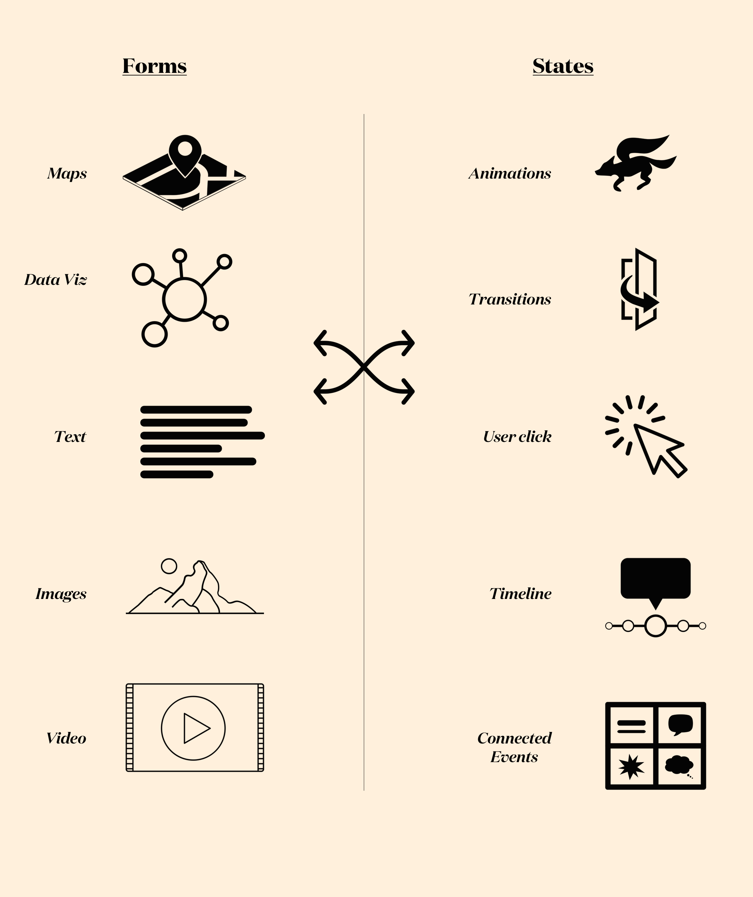
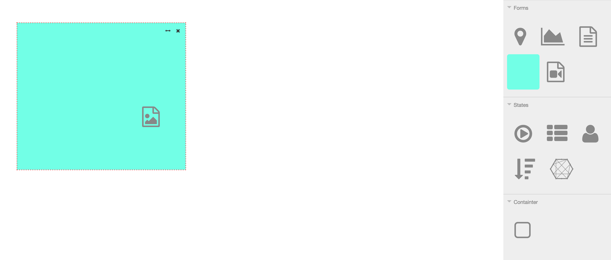
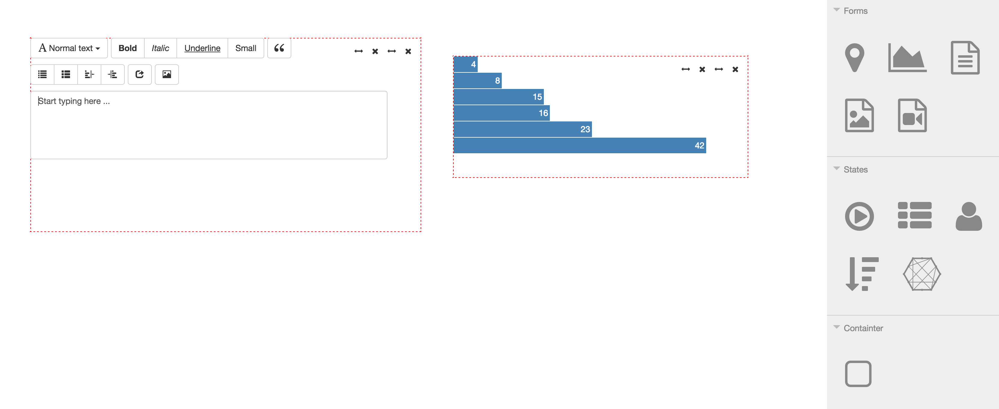

Thesis! (Work in Progress)

## StoryBlocks ##

Look at an example here https://vimeo.com/128038770 and 

https://vimeo.com/128038818

 

####Summary####
Storyblocks is a tool for journalists to assemble and visualize data stories. It is a toolkit from which journalists can easily create dynamic and interactive narratives using media and data.

The web has enabled the decentralization of capturing and spreading news. This allows us to afford new kinds of interactions, but creating these interactions has required specialized skills and knowledge in order to present the information in a meaningful way. Storyblocks lowers this barrier by providing a flow based interface for journalists that facilitates the creation of webpages that are visual and dynamic. The interface is a set of container blocks that offer visual displays types that can stand alone or be connected with each other and intergrated into a web page for online publication. These interconnected components change depending on the context of information flowing in, creating a dynamic, visual narrative. 

####Description####

 
StoryBlocks is a flow based environment to create interactive webpages by dragging and dropping components. Its aimed at journalists/independent bloggers however the low technical entry point means that any user is able to create webpages regardless of their technical skill level. 
 

The main principle behind the project is the fact that todays websites are fundamentally dynamic in nature. And therefore the project treats **interactions** as first class citizens.

Currently the following are supported:

1. Graphs/Charts
2. Images
3. Video
4. Text
5. Graphics (2D and 3D coming soon)

Interactions:

1. User click
2. Animations
3. Timeline
4. Transitions
5. Connected events

###Installation###

1. npm install
2. Enter twitter api keys in server.js if you want to use twitter
3. nodemon server.js
3. Go to localhost:3000/

###Demo###

This is a work in progress but the demo will be up soon on my website at adarshk.com and the link will be updated here to reflect that.

###Sample images###
**Concept**

**Working Prototype**

###Tech###

Thanks to these great opensource libraries that StoryBlocks uses

1. d3.js (for graphs)
2. threejs.org/editor
3. jquery
4. interactjs (for resize and move)
5. jsplumb

###FAQ###
 

<!--

1. What level of technical knowledge is required to use this tool?   A. StoryBlocks abstracts away things like graphs, charts and graphics and provides a low barrier to entry ideally making it really simple to use.  
2. How is this different from things like webflow.com or other similar tools?  A. Whereas the aim of webflow and others is to try to abstract away programming for people, StoryBlocks brings the [flow based programming](http://en.wikipedia.org/wiki/Flow-based_programming) paradigm to creating webpages. Its a different way of thinking about interactions and interfaces.

-->

###License###

MIT